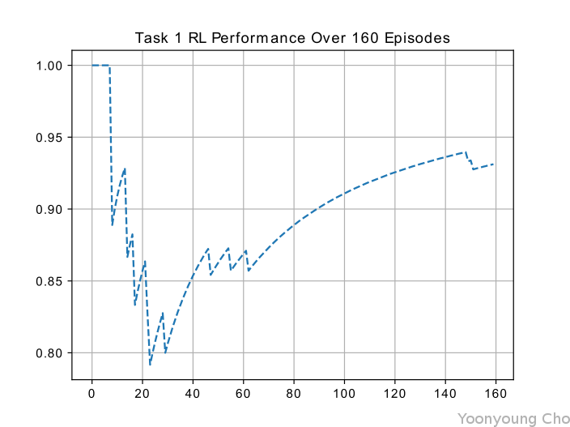
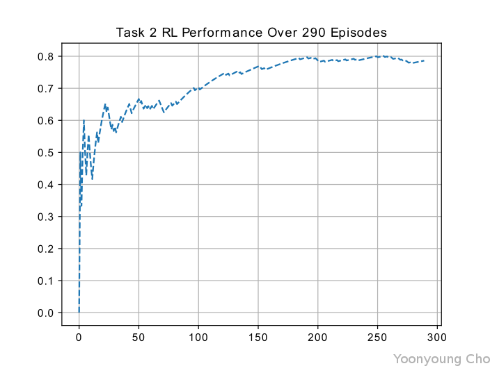

# Deep RL Arm Manipulation

Udacity Robotics Software Nanodegree Term II Project 4

Yoonyoung Cho, 10/23/2018 


## Description

In modern robotics, Reinforcement Learning algorithms has revealed a new horizon where challenging robotics problems could be resolved in an end-to-end manner.

The advantage of the algorithm, apart from its vast representative powers, is that the control logic is liberated from chained conditionals, arbitrary heuristics and heavily constrained parameter tuning procedures. Besides, such algorithms have proven to be highly adaptable to previously unseen *edge-case* scenarios, which by definition cannot be accounted for prior to deployment.

||
|:-:|
|Fig.1: Representative sample image collected during the training process.|

In the project, an model problem that serves abstraction of a 3-DoF Robot Arm kinematic control for object manipulation is presented and solved through Deep Q-Learning Networks, a recent advancement in the Reinforcement Learning Community that learns a functional representation of the value association with the state-action space. The solution is realized through a gazebo plugin for the arm, operating via a C++ API for the popular PyTorch library for deep learning frameworks.

## Control Scheme

While two options were available for the the robot arm kinematic control, the simpler positional-control scheme was chosen.

In summary, the discrete action encoding was as follows:

|index| action |
|:---:|:------:|
|0    | DEC J0 |
|1    | INC J0 |
|2    | DEC J1 |
|3    | INC J1 |
|4    | DEC J2 |
|5    | INC J2 |

(Note that action 0 and 1 were disabled for task 1 and 2, and only applied for the challenge problem.)

Where *INC* and *DEC* represents incrementing the joint angular position value by a small amount.

Which could be compactly represented as:

    pos[a/2] += (a&1)?Δθ:-Δθ

## World Configuration

Prior to the training procedure, a number of noteworthy modifications were applied to `gazebo-arm.world` to maximize the convenience.

### Loading

A bug in the Gazebo simulation was preventing the simulation to load rapidly, with the following error message:

```bash
[Err] [Scene.cc:2927] Light [sun] not found. Use topic ~/factory/light to spawn a new light.
```

Unlike the instructions specified, the error was never resolved and the world failed to load entirely.

To mitigate this issue, the arm model was separated out into [arm.sdf](gazebo/arm.sdf), which was then loaded as follows:

```bash
gazebo gazebo-armless.world --verbose &
gz model --spawn-file=arm.sdf --model-name=arm
```

The above excerpt can also be found in [gazebo-arm.sh](gazebo/gazebo-arm.sh).

### Acceleration

In order to expedite the training process, the simulation physics was accelerated to run faster than real-time:

```xml
<physics name='default_physics' default='0' type='ode'>
    <gravity>0.000000 0.000000 -9.800000</gravity>
    <max_step_size>0.001</max_step_size>
    <real_time_update_rate>0.0</real_time_update_rate>
    <!-- run as fast as possible -->
</physics>
```

On a desktop equipped with an `Intel i7-7700K` cpu with `NVIDIA GTX1080-Ti`, the training simulation was executed at approximately 6.5x acceleration from real time, which was a significant improvement.


## Reward Function

[//]: # (Reward Functions: Explain the reward functions that you created. Brief explanation of each reward function and associated reward values. The writeup should also include what type of joint control was implemented.)

|event|reward|
|:---:|:----:|
|gcol   | -1.0 |
|ocol   | -1.0 |
|eoe    | -1.0 |
|suc    |  1.0 |
|inter  | &Delta;d|
Where *gcol* *ocol*, *eoe* and *suc* stand for *Ground Collision*, *Object Collision*, *End of Episode*, and *Success*, respectively.

For task 1, however, Object Collision is considered a success, so *suc* takes precedence.

## Hyperparameters

[//]: # (Specify the hyperparameters that you selected for each objective, and explain the reasoning behind the selection. Student should explain the choice of hyperparameters for both objectives.)

## Results

[//]: # (Explain the results obtained for both objectives. Include discussion on the DQN agent's performance for both objectives. Include watermarked images, or videos of your results.)
[//]: # (Student should describe and briefly explain the results they achieved for both objectives. The discussion should also include their comments on the DQN agent's performance and if there were any shortcomings. Student should include either watermarked images of their results, or attach a video that displays the results and the arm in action.)

## Task 1


Task 1 was successfully completed, as seen in the following figures:

||
|:-:|:-:|
|Cap1|Cap2|

The training 

## Task 2

||
|:-:|:-:|
|Cap1|Cap2|

## Challenge


The challenge configuration included a randomly spawned object in the simulated arena, as well as an added degree of freedom on the base joint of the the robot arm.


### Randomization

In order to make a more realistic model of the object manipulation scenario, the operating range of the arm was computed based on the kinematic constraints.


Accordingly, the feasible operating range was computed where both &theta;1 and &theta;2 were within the joint limits of [-0.5,2.0].

Objects were spawned within the computed region where the arm was guaranteed to be able to reach, in order to avoid *impossible* scenarios.

||
|:-:|
|Fig.x: Visualization of the arm operable range; note that a small section of the default spawning area violates the kinematic constraint.|

One particular detail that was considered for the training scenario was to spawn the objects where the camera could see the object without occlusion by the robot body, indicated by the cutoff line in the figure.

## Future Work
[//]: # (Briefly discuss how you can improve your current results.)
