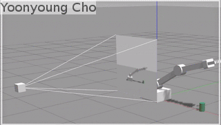
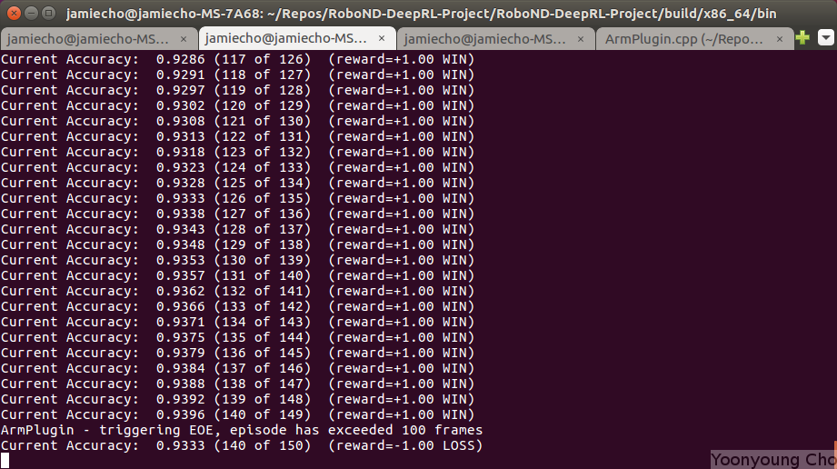
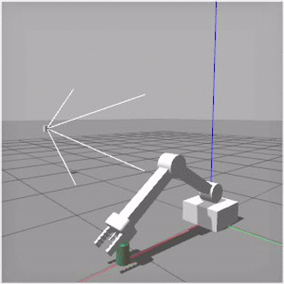
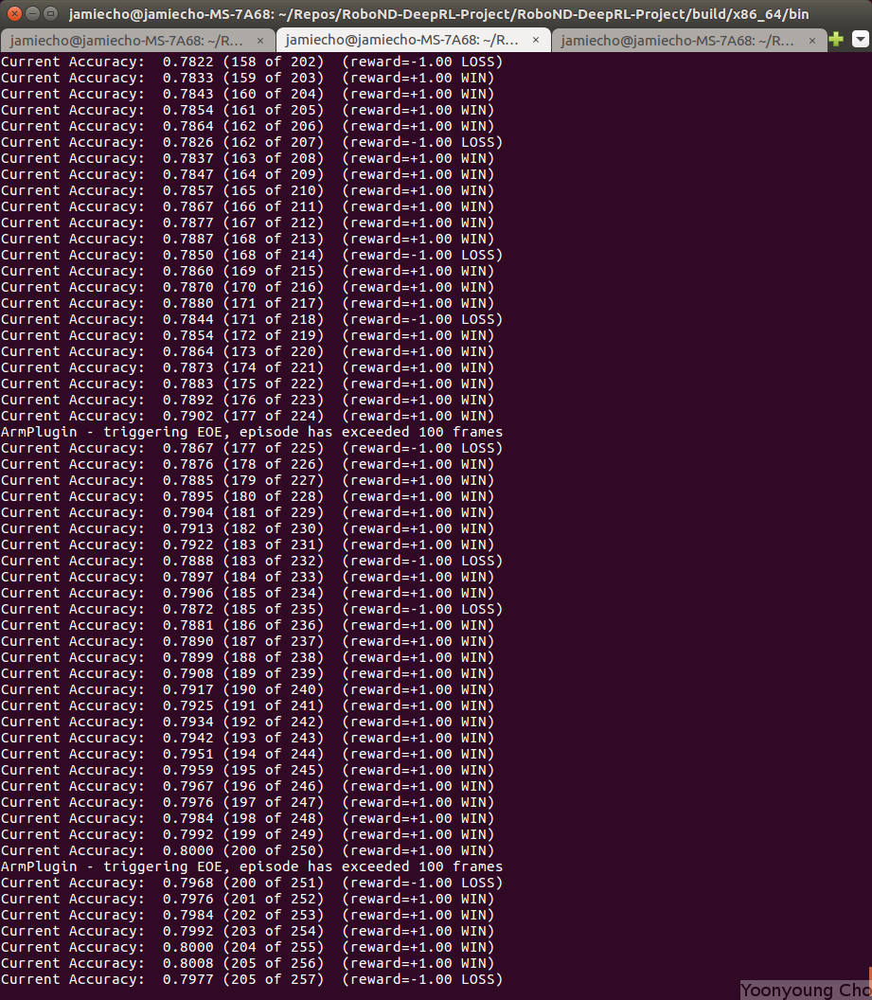
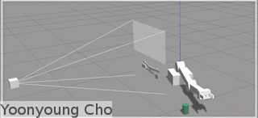
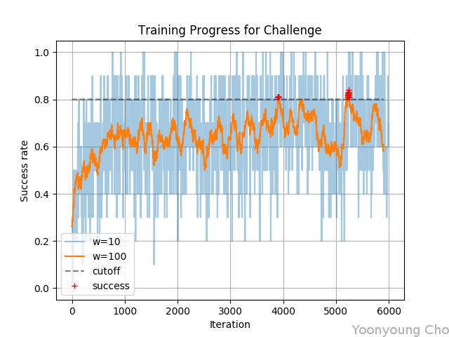

# Deep RL Arm Manipulation

Udacity Robotics Software Nanodegree Term II Project 4

Yoonyoung Cho, 10/23/2018 

## Description

||
|:-:|
|Fig.1: Robot Arm Model Visualization.|

In modern robotics, Reinforcement Learning algorithms has revealed a new horizon where challenging robotics problems could be resolved in an end-to-end manner.

The advantage of the algorithm, apart from its vast representative powers, is that the control logic is liberated from chained conditionals, arbitrary heuristics and heavily constrained parameter tuning procedures. Besides, such algorithms have proven to be highly adaptable to previously unseen *edge-case* scenarios, which by definition cannot be accounted for prior to deployment.

||
|:-:|
|Fig.2: Representative sample image collected during the training process.|

In the project, an model problem that serves abstraction of a 3-DoF Robot Arm kinematic control for object manipulation is presented and solved through Deep Q-Learning Networks, a recent advancement in the Reinforcement Learning Community that learns a functional representation of the value association with the state-action space. The solution is realized through a gazebo plugin for the arm, operating via a C++ API for the popular PyTorch library for deep learning frameworks.

## Control Scheme

While two options were available for the the robot arm kinematic control, the simpler positional-control scheme was chosen.

In summary, the discrete action encoding was as follows:

|index| action |
|:---:|:------:|
|0    | DEC J0 |
|1    | INC J0 |
|2    | DEC J1 |
|3    | INC J1 |
|4    | DEC J2 |
|5    | INC J2 |

(Note that action 0 and 1 were disabled for task 1 and 2, and only applied for the challenge problem.)

Where *INC* and *DEC* represents incrementing the joint angular position value by a small amount.

Which could be compactly represented as:

    J[a/2] += (a&1)?Δθ:-Δθ

Where the joint limits clipping is applied afterwards.

## World Configuration

Prior to the training procedure, a number of noteworthy modifications were applied to `gazebo-arm.world` to maximize the convenience.

### Loading

A bug in the Gazebo simulation was preventing the simulation to load rapidly, with the following error message:

```bash
[Err] [Scene.cc:2927] Light [sun] not found. Use topic ~/factory/light to spawn a new light.
```

Unlike the instructions specified, the error was never resolved and the world failed to load entirely.

To mitigate this issue, the arm model was separated out into [arm.sdf](gazebo/arm.sdf), which was then loaded as follows:

```bash
gazebo gazebo-armless.world --verbose &
gz model --spawn-file=arm.sdf --model-name=arm
```

The above excerpt can also be found in [gazebo-arm.sh](gazebo/gazebo-arm.sh).

### Acceleration

In order to expedite the training process, the simulation physics was accelerated to run faster than real-time:

```xml
<physics name='default_physics' default='0' type='ode'>
    <gravity>0.000000 0.000000 -9.800000</gravity>
    <max_step_size>0.001</max_step_size>
    <real_time_update_rate>0.0</real_time_update_rate>
    <!-- run as fast as possible -->
</physics>
```

On a desktop equipped with an `Intel i7-7700K` cpu with `NVIDIA GTX1080-Ti`, the training simulation was executed at approximately 6.5x acceleration from real time, which was a significant improvement.


## Reward Function

[//]: # (Reward Functions: Explain the reward functions that you created. Brief explanation of each reward function and associated reward values. The writeup should also include what type of joint control was implemented.)

|event|reward| description |
|:---:|:----:|:-----------:|
|gcol   | -1.0 | Ground Collision Penalty |
|ocol   | -1.0 | Object Collision Penalty (Task 2 only) |
|eoe    | -1.0 | End of Episode Penalty |
|suc    |  1.0 | Success Reward |
|int  | 5.0 &#215; &Delta;d| Interim Reward |
|&alpha; | 0.2 | Interim Distance Smoothing Factor |

While other factors are fairly intuitive, the interim reward may not be immediately obvious; this reward corresponds to the small signals throughout the process of executing the episode that serve as indicators that positive progress is being made towards achieving the goal. This is calculated as:

```C
float distGoal = BoxDistance(gripBBox, propBBox); // distance to goal
float distDelta  = lastGoalDistance - distGoal; // distance "improvement"

// compute the smoothed moving average of the delta of the distance to the goal
avgGoalDelta = lerp(avgGoalDelta, distDelta, ALPHA);
reward = REWARD_BOOST * avgGoalDelta;
lastGoalDistance = distGoal;
```

The above excerpt is also available in context at [ArmPlugin.cpp](gazebo/ArmPlugin.cpp).

While the boost factor for the interim reward for task 1 and 2 was sufficient when kept at 1.0, the *challenge* task required the signal to be scaled at 5.0&#215; in order to guarantee reliable performance. This is partly to do with the complexity of the task and how sparsely the final reward signal is propagated.

As &Delta;d generally stayed around the order of 0.01, the 5&#215; boost did not completely outweigh the final reward; another important factor for the interim reward is that the robot does not reap any additional benefits from simply waiting near the spawned object, as the reward is *roughly* proportional to the approaching velocity, rather than the positional offset.

## Hyperparameters

[//]: # (Specify the hyperparameters that you selected for each objective, and explain the reasoning behind the selection. Student should explain the choice of hyperparameters for both objectives.)

After a series of qualitative explorations in the parameter space, the following set of parameters were proven to work well on all three tasks:

|parameter|value| description |
|:---:|:----:|:-----------:|
|width   | 64 | Input Image Width |
|height   | 64 | Input Image Height |
|channel  | 3  | Input Image Channels (Depth) |
|batch size | 32 | Input data batch size |
|replay memory | 10000 | Size of Memory buffer for Experience Replay |
|optimizer | Adam | DQN Network Loss Optimizer |
|learning rate | 5e-3 | Network Learning Rate |
|lstm | false | flag to enable recurrent network (LSTM) |
|delta | 0.087 | Joint angle increment per step in radians (5 degrees) |
|eps decay | 400 | Epsilon Decay Steps |

#### Input Dimensions

The *width* and *height* parameters were reduced from the original 512x512, as the input size was excessively large and did not provide a significant increase in benefits. The observed scenario required corase features such as the location of the objects and the location of the arm joints and the orientation, which was sufficiently encoded to a 64x64 image. Proof of this can be seen in Fig.2.

After observing a perplexing out-of-memory error on the GPU wth 11GB memory, the overall input dimensions were tuned down out of fear that a successful training session may be terminated abruptly. The adjusted dimensions including the batch size and the replay memory. In general, however, the occupied size of the RL network generally remained below 2GB afterwards.

#### Optimization

While the *RMSProp* optimizer from the *catch* example worked quite well, my personal inclination for most Deep Learning tasks is to default to the *Adam* Optimizer for its applicability in a vast number of different domains and the general robustness to un-tuned parameters.

The initial guess for the learning rate was *1e-2*, but this was halved after observing the network potentially converging to a sub-optimal solution too quickly on Challenge 3. An example of this is to repeat the same action despite seeing different states, in favor of previous examples that may have been successful due to chance.

#### Miscellanous

The control adjustment coefficient *delta* was set to about 5 degrees, since the maximum episode length was 100 steps and the total required number of angular displacement from the origin would have been approximately 36 with the scheme. Accounting for possible lags and indeterminate noise in the middle of the operation, setting the step size to about 5 degrees allowed for enough room during the training cycle to compensate for intermediate errors, while not moving so fast that the network could not account for the instability.

The epsilon decay was not part of the standard parameters for tuning, but I increased the decay steps two-folds in order to ensure that the network has enough time to explore the parameter space before converging to a solution. Considering the epsilon update equation, the resultant behavior can be summarized as follows:

||
|:-:|
|Fig.x: Epsilon decay characteristics; note that for d=400, the exploration lasts for a longer period.|

## Results

[//]: # (Explain the results obtained for both objectives. Include discussion on the DQN agent's performance for both objectives. Include watermarked images, or videos of your results.)
[//]: # (Student should describe and briefly explain the results they achieved for both objectives. The discussion should also include their comments on the DQN agent's performance and if there were any shortcomings. Student should include either watermarked images of their results, or attach a video that displays the results and the arm in action.)

## Task 1



In task 1, the robot arm was operating with two degrees of freedom on the upper two joints, without rotating around the z-axis. In order to reduce the state-space of the problem, the object was kept at a fixed location throughout the task, and the mission was considered successful when the arm touched

Task 1 was successfully completed, as seen in the following figures:

||
|:-:|:-:|
|Fig.x: Snapshot of the log during execution.|Task 1 Progress plot; all successful instances over a running average window of 100 iterations are marked in red.|

## Task 2



Task 2 was largely operating in the same domain as Task 2, except the complication that only one part of the robot arm was permitted to contact the object -- namely, the *gripper_base*. Otherwise, the mission was considered a failure. Indeed, this addition made the problem significantly more difficult to converge rapidly.

||
|:-:|:-:|
|Fig.x: Snapshot of the log during execution.|Task 2 Progress plot; all successful instances over a running average window of 100 iterations are marked in red.|

## Challenge



The challenge configuration included a randomly spawned object in the simulated arena, as well as an added degree of freedom on the base joint of the the robot arm.

In order for the problem to be tractable, I chose the challenge to be a variant on task 1, rather than task 2, where merely a contact with the object is considered a successful run.

Otherwise, the reward signals on successful were too sparse to be propagated throughout the network.

### Configuration

In order to make a more realistic model of the object manipulation scenario, the operating range of the arm was computed based on the kinematic constraints.

Note that joint 0 was omitted in distance validation, as it only governs the yaw angle.

||
|:-:|
|Fig.x: Robot Arm Kinematic Constraint Formulation.|

Accordingly, the feasible operating range was computed where both &theta;1 and &theta;2 were within the joint limits of [-0.5,2.0].

Objects were spawned within the computed region where the arm was guaranteed to be able to reach, in order to avoid *impossible* scenarios.

||
|:-:|
|Fig.x: Visualization of the arm operable range; note that a small section of the default spawning area violates the kinematic constraint.|

One particular detail that was considered for the training scenario was to spawn the objects where the camera could see the object without occlusion by the robot body, indicated by the cutoff line in the figure.

### Results

||
|:-:|
|Fig.x: Challenge progress plot; blue and orange lines indicate running average of the success rate over 10 and 80 iterations, respectively.|

Overall, the robot achieved compelling performance on the challenge task, where the final success rate settled around 75%.

One impressive aspect of the model is that both the robot's current orientation information in the z-axis and the object's position could be fully decoded from the input image, despite being a cross-sectional projection of the training arena where distance in the y-coordinate was only represented through the size of the object.

## Future Work

[//]: # (Briefly discuss how you can improve your current results.)

While the DQN agent was able to achieve compelling performance on all three tasks as demonstrated above, one recent advancement in Reinforcement Learning is the incorporation of the Recurrent Network in order to represent temporal correlations in the state-space.

For instance, when considering human perception, humans often have difficulty discerning whether or not another person is walking towards or away from the observer solely based on the sillouette, as the sinusoidal motion of the leg is visually quite similar in either direction. While the network was able to discern the correlation between the relative size of the object and the depth, this will not be possible in scenarios where the observed area is at a large distance.

One problem that the agent cannot currently handle is when the object itself is fully occluded by the robot itself - if the projected profile of the robot covers the object, then the decision of the DQN network at that instant is non-deterministic and may result in unstable oscillations. In order to avoid this scenario, the objects were spawned in locations where camera visibility and reachability were both guaranteed.

One way in which the occlusion problem could be tackled is the incorporation of recurrent networks to track and represent the movements and to plan in longer terms; it is quite intuitive to see how the perception of self-motion (i.e. the current position of the robot arm) as well as the object localization could be improved by state information that persist across longer durations.